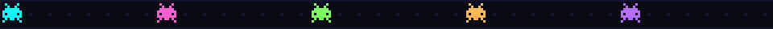

<!-- ============================================
     kevtronix — custom pixel arcade profile
     ============================================ -->

<!-- ANIMATED PIXEL HEADER — custom hand-built SVG -->

  

<!-- 🟡 THE GAME -->

  <picture>
    <source media="(prefers-color-scheme: dark)" srcset="https://raw.githubusercontent.com/kevtronix/kevtronix/output/pacman-contribution-graph-dark.svg" />
    <source media="(prefers-color-scheme: light)" srcset="https://raw.githubusercontent.com/kevtronix/kevtronix/output/pacman-contribution-graph.svg" />
    
  </picture>
   
  every commit is a pellet · big days are power pellets 👻

  

<!-- 👾 PLAYER 1 -->

- 🏛️ **By day:** Programmer for state government 
- 🔬 **Now building:** a deep research tool that runs on *any* model provider — novel search strategies, balanced call orchestration, full web UI
- 🤖 **Agentic harnesses:** configuring & pushing the limits of Claude Code, Pi Coding Agent, and Hermes for automation pipelines
- 🎛️ **Model work:** custom models with tuned parameters for **deterministic output** — built, evaluated, and hosted locally
- ⚙️ **Core kit:** Python for everything serious, SQL for the data, TypeScript/JS when it needs a frontend

<!-- 🍒 POWER-UPS -->

**🪙 earlier levels:** React · Remix · Django · GitHub Actions · AWS · GCP

<!-- 🏆 HIGH SCORES -->

  
  

<!-- ❤️ 2 PLAYER MODE -->

<!-- ANIMATED GAME OVER FOOTER -->

  

